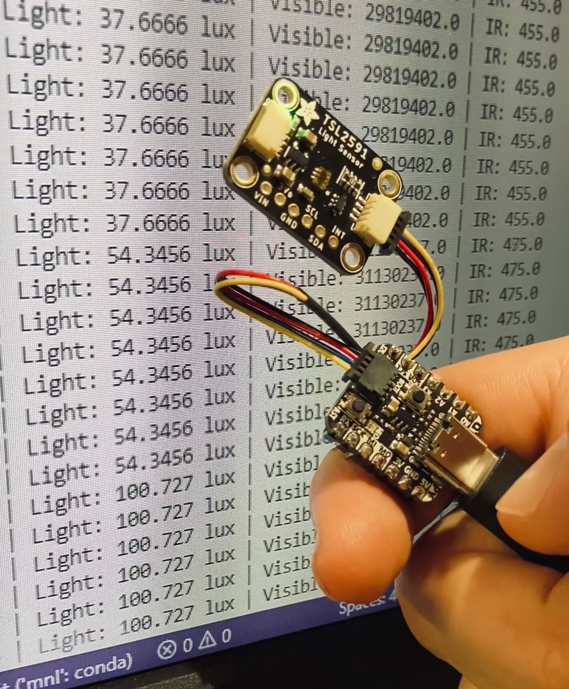

# Light_sensor
Save data from a [TSL2591 light sensor](https://learn.adafruit.com/adafruit-tsl2591/) ([instructions](https://learn.adafruit.com/adafruit-tsl2591/python-circuitpython)) connected to a [QT Py RP2040](https://www.adafruit.com/product/4900) with a [STEMMA QT cable](https://www.adafruit.com/product/4399) and your PC via USB.

## How it works
When the 'boot' button on the QT Py is pressed, it continuously saves data from the light sensor in a csv file on your computer until the 'boot' button is pressed again.

> NOTE: if you prefer not to use the 'boot' button to indicate start/stop, but you'd rather record light values continuously, then check out the *Continuous-acquisition* branch in this repository.

## Requirements
You need to have the python package [serial](https://pythonhosted.org/pyserial/) installed in your environment.

## Setup and use instructions

- Connect the QT Py to your computer via USB
- Configure the QT Py according to [these instructions](https://learn.adafruit.com/adafruit-qt-py-2040/circuitpython) if you have not already done so
- Copy over the following to the "lib" folder on your CIRCUITPY (D:) drive from one of the [CircuitPython library bundles](https://circuitpython.org/libraries):

  **Files:**
  - adafruit_tsl2591.mpy
  - neopixel.mpy

  **Folders:**
  - adafruit_bus_device
  - adafruit_circuitplayground

- Copy the contents of the *code.py* file in this repository into the *code.py* file on your CIRCUITPY (D:) drive
- Connect the light sensor to the QT Py with the STEMMA QT cable
- Specify which USB port the QT Py is connected to by modifying the 'ser' variable within *serial_reader.py* (default port: COM3)
- Specify which folder the csv file should be saved in on your PC by modifying the 'root_folder' variable within *serial_reader.py* (default location: C:/DATA/Sensor_data)
- Run the *serial_reader.py* file in your terminal
- When the word 'Ready' is shown, press the 'boot' button on the QT Py to start recording light values. These will also be printed out in your terminal. The LED on the QT Py will turn off to indicate that the recording is in progress
- Press the 'boot' button again to stop recording values
- A csv file with the recorded values and timestamps can now be found in the location you specified

